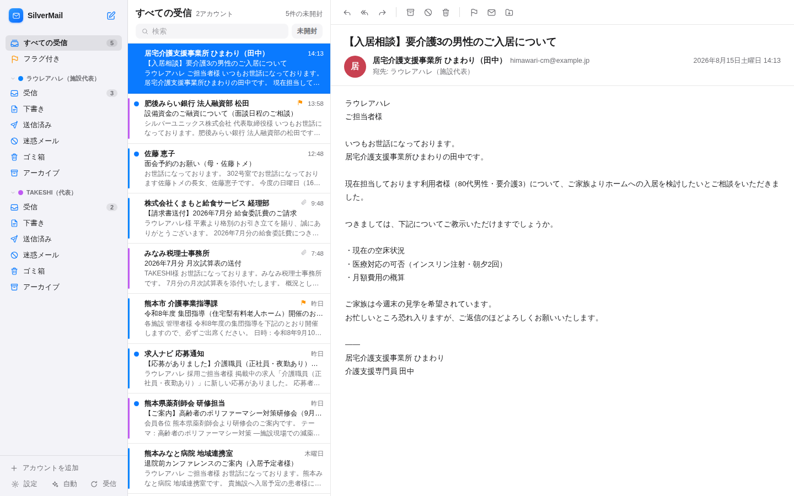
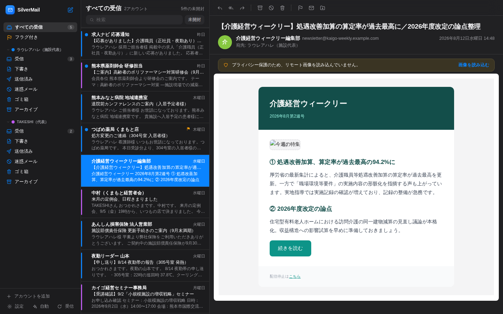

# ✉️ SilverMail

**複数のメールアカウントをひとつにまとめる、Mac向けローカルメールクライアント**

iPhoneの「メール」アプリのように複数アカウント（Gmail・iCloud・Yahoo!メール・独自ドメイン等）を統合受信でまとめて管理できる、シルバーユニックスのためのメーラーです。データはすべて自分のMacの中だけで完結します。

| ライト | ダーク |
|---|---|
|  |  |

## 特徴

- **統合受信ボックス** — 全アカウントの受信メールを1つの一覧に。アカウントカラーの色分けでひと目で見分けられます
- **本物のIMAP/SMTP** — Gmail・iCloud・Yahoo!メール・レンタルサーバー（Xserver・さくら等）に実際に接続。閲覧・検索・送信・返信・転送・添付・フラグ・アーカイブ・フォルダ移動・下書き保存に対応
- **プライバシー第一**
  - パスワードは**macOSキーチェーン**に保存（他OSでは `~/.silvermail/` に0600権限で保存）
  - メール内の**リモート画像を既定でブロック**（開封トラッキング対策・ワンクリックで表示可）
  - HTMLメールはサンドボックス化したフレーム＋CSPで隔離表示（スクリプトは実行されません）
  - サーバーは `127.0.0.1` のみで待ち受け。外部Webサイトからのアクセスは拒否（Origin/Hostチェック）
- **Apple Mail風の3ペインUI** — ライト/ダーク対応・ペイン幅の調整・右クリックメニュー・ホバーのクイックアクション
- **キーボードで速い** — `↑↓`移動・`E`アーカイブ・`⌫`削除・`F`フラグ・`U`未読・`R`返信・`⌘N`新規・`⌘Enter`送信・`/`検索
- **新着チェックとデスクトップ通知** — 設定した間隔で自動受信し、新着を通知（オプトイン）
- **デモモード** — アカウントを繋がなくても、サンプルメールで全機能を試せます

## 必要なもの

- macOS（Apple Silicon / Intel どちらも可）※Linux/Windowsでも動作します
- [Node.js](https://nodejs.org/ja) 18以上（LTS版推奨・`brew install node` でも可）

## はじめかた

```bash
cd mailer
npm install --omit=dev   # 初回のみ（実行用の4パッケージだけが入ります）
npm start                # → ブラウザが自動で開きます（http://localhost:8744）
```

Finderから使う場合は **`SilverMail.command` をダブルクリック**でも起動できます
（初回は 右クリック → 開く。セットアップも自動で行われます）。

まずは試したいだけなら:

```bash
npm run demo             # デモアカウント2つ＋サンプルメール入りで起動
```

## アカウントの追加

起動後「アカウントを追加」からプロバイダを選ぶと、サーバー設定は自動で入ります。

| プロバイダ | 準備すること |
|---|---|
| **Gmail** | Googleアカウントで2段階認証を有効にし、[アプリパスワード](https://myaccount.google.com/apppasswords)を作成して、そのパスワードで追加 |
| **iCloud** | [appleid.apple.com](https://account.apple.com/) →「サインインとセキュリティ」→「アプリ用パスワード」を発行 |
| **Yahoo!メール** | Yahoo!メールの設定で「IMAP・POP・SMTPアクセス」を有効化 |
| **独自ドメイン**（Xserver・さくら等） | 「その他」を選び、メールアドレス入力後「サーバーを自動検出」。検出できない場合は契約時のメール設定情報（IMAP/SMTPホスト名）を入力 |

追加前に「接続テスト」で受信（IMAP）・送信（SMTP）の両方を確認できます。

> **Outlook.com（個人）について**: Microsoftは個人アカウントのIMAP基本認証を廃止したため接続できない場合があります。Microsoft 365（組織）は管理者がIMAP/SMTP AUTHを許可していれば利用できます。

## データの保存場所

| 内容 | 場所 |
|---|---|
| アカウント設定 | `~/.silvermail/accounts.json`（0600） |
| パスワード | macOSキーチェーン（サービス名 `SilverMail`）／他OSは上記ファイル内 |
| アプリ設定 | `~/.silvermail/settings.json` |

メール本文はサーバー（IMAP）側に置いたまま都度取得します。ローカルへの全文複製は行いません。
アカウントを削除してもサーバー上のメールは消えません。

## 開発

```bash
npm install        # devDependencies（esbuild / React）込み
npm run build      # src/ → public/app.js（ビルド済みをコミットする運用）
npm run watch      # 監視ビルド
npm run demo       # デモデータで起動
```

構成:

```
mailer/
├── server/          # Node.js（express / imapflow / mailparser / nodemailer）
│   ├── index.js     #   本体（127.0.0.1限定・Origin/Hostガード）
│   ├── api.js       #   REST API
│   ├── imap.js      #   IMAP接続プール・全メール操作
│   ├── smtp.js      #   送信・送信済み/下書きAPPEND
│   ├── sanitize.js  #   HTMLメールのサニタイズ・リモート画像ブロック
│   ├── store.js     #   アカウント/設定の永続化・キーチェーン連携
│   └── demo.js      #   デモモード（インメモリ）
├── src/             # React UI（Apple Mail風3ペイン）
├── public/          # 配信ファイル（ビルド済みapp.jsを含む）
└── scripts/         # esbuildビルド
```

## 既知の制限

- スレッド（会話）表示は未対応（一覧は新着順）
- OAuth認証（Outlook.com個人など）は未対応。アプリパスワード方式のプロバイダをご利用ください
- 送信はテキストメール（+自動生成のHTMLパート）。リッチテキスト編集は未対応

## トラブルシューティング

- **「認証に失敗しました」** — Gmail/iCloudは通常のパスワードではなく**アプリパスワード**が必要です
- **ポートが使用中** — `PORT=8745 npm start` のように別ポートを指定できます
- **会社のメールに繋がらない** — IMAPが無効化されている場合があります。メールサーバーの管理者にIMAP/SMTPのホスト名とポートをご確認ください
