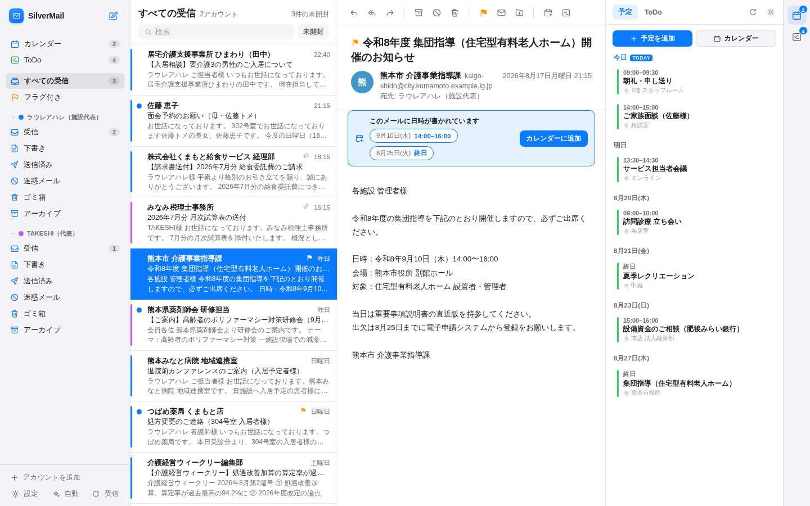
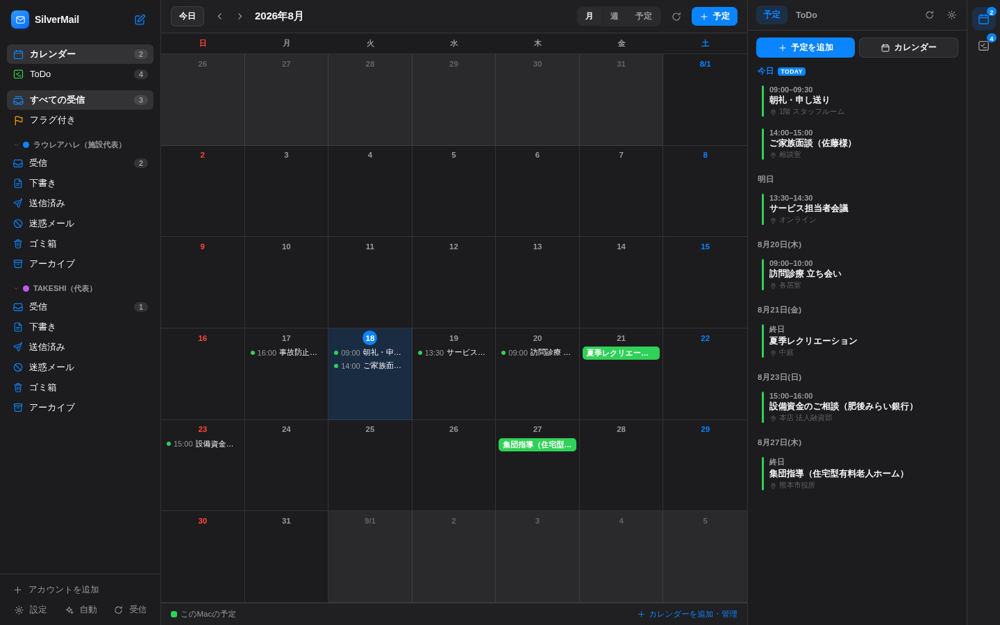

# ✉️ SilverMail

**複数のメールアカウントと、カレンダー・ToDoをひとつにまとめる、Mac向けローカルクライアント**

iPhoneの「メール」アプリのように複数アカウント（Gmail・iCloud・Yahoo!メール・独自ドメイン等）を統合受信でまとめ、Gmailのようにメールの横へカレンダーとToDoを並べて表示します。メールに書かれた日時はそのままワンクリックで予定にできます。データはすべて自分のMacの中だけで完結します。

| ライト | ダーク |
|---|---|
|  |  |

| メールから予定を作る | カレンダー（月表示） |
|---|---|
|  |  |

## 特徴

- **統合受信ボックス** — 全アカウントの受信メールを1つの一覧に。アカウントカラーの色分けでひと目で見分けられます
- **本物のIMAP/SMTP** — Gmail・iCloud・Yahoo!メール・レンタルサーバー（Xserver・さくら等）に実際に接続。閲覧・検索・送信・返信・転送・添付・フラグ・アーカイブ・フォルダ移動・下書き保存に対応
- **カレンダーとToDoを横に並べて表示** — メールを読みながら右のパネルで今日以降の予定と未完了のToDoを確認できます（Gmailのサイドパネル方式）。月／週／予定リストの全画面カレンダーも内蔵
- **メールから直接スケジュールへ** — 本文の「令和8年9月10日（木）14:00〜16:00」「明日15時から1時間半」といった日本語の日時を自動で読み取り、ワンクリックで予定に登録。件名がタイトル、差出人が参加者、本文がメモに入り、予定からは元のメールへ戻れます。「ToDoに追加」も1クリック
- **Googleカレンダー / Google ToDo と双方向** — 閲覧だけでなく、SilverMailから予定の追加・変更・削除、ToDoの作成・完了までできます。iCalのURL購読（読み取り専用）にも対応し、連携なしで使える「このMacの予定」も用意
- **プライバシー第一**
  - パスワードと連携トークンは**macOSキーチェーン**に保存（他OSでは `~/.silvermail/` に0600権限で保存）
  - メール内の**リモート画像を既定でブロック**（開封トラッキング対策・ワンクリックで表示可）
  - HTMLメールはサンドボックス化したフレーム＋CSPで隔離表示（スクリプトは実行されません）
  - サーバーは `127.0.0.1` のみで待ち受け。外部Webサイトからのアクセスは拒否（Origin/Hostチェック）
- **日本語メールに強い** — ISO-2022-JP（JIS）・Shift_JIS・EUC-JP・UTF-8を自動判別。一覧のプレビューは1コマンドでまとめて取得するため、50件でも待たされません
- **Apple Mail風の3ペインUI** — ライト/ダーク対応・ペイン幅の調整・右クリックメニュー・ホバーのクイックアクション
- **キーボードで速い** — `↑↓`移動・`E`アーカイブ・`⌫`削除・`F`フラグ・`U`未読・`R`返信・`S`予定を作成・`T`ToDoに追加・`⌘N`新規・`⌘Enter`送信・`/`検索
- **新着チェックとデスクトップ通知** — 設定した間隔で自動受信し、新着を通知（オプトイン）
- **デモモード** — アカウントを繋がなくても、サンプルのメール・予定・ToDoで全機能を試せます

## 必要なもの

- macOS（Apple Silicon / Intel どちらも可）※Linux/Windowsでも動作します
- [Node.js](https://nodejs.org/ja) 18以上（LTS版推奨・`brew install node` でも可）

## はじめかた

```bash
cd mailer
npm install --omit=dev   # 初回のみ（実行用の4パッケージだけが入ります）
npm start                # → ブラウザが自動で開きます（http://localhost:8744）
```

Finderから使う場合は **`SilverMail.command` をダブルクリック**でも起動できます
（初回は 右クリック → 開く。セットアップも自動で行われます）。

まずは試したいだけなら:

```bash
npm run demo             # デモアカウント2つ＋サンプルのメール・予定・ToDo入りで起動
```

終了するには、起動したターミナルで `Ctrl+C` を押します。
別のターミナルからでも `npm run stop` で終了できます。

## アカウントの追加

起動後「アカウントを追加」からプロバイダを選ぶと、サーバー設定は自動で入ります。

| プロバイダ | 準備すること |
|---|---|
| **Gmail**（Google Workspaceの独自ドメインを含む） | Googleアカウントで2段階認証を有効にし、[アプリパスワード](https://myaccount.google.com/apppasswords)（16文字）を作成して、そのパスワードで追加。通常のログインパスワードでは接続できません |
| **iCloud** | [appleid.apple.com](https://account.apple.com/) →「サインインとセキュリティ」→「アプリ用パスワード」を発行 |
| **Yahoo!メール** | Yahoo!メールの設定で「IMAP・POP・SMTPアクセス」を有効化 |
| **独自ドメイン**（Xserver・さくら等） | 「その他」を選び、メールアドレス入力後「サーバーを自動検出」。検出できない場合は契約時のメール設定情報（IMAP/SMTPホスト名）を入力 |

追加前に「接続テスト」で受信（IMAP）・送信（SMTP）の両方を確認できます。

> **Outlook.com（個人）について**: Microsoftは個人アカウントのIMAP基本認証を廃止したため接続できない場合があります。Microsoft 365（組織）は管理者がIMAP/SMTP AUTHを許可していれば利用できます。

## カレンダーとToDoの接続

右パネルの歯車、またはカレンダー画面下の「カレンダーを追加・管理」から設定します。方式は3つあります。

| 方式 | できること | 準備 |
|---|---|---|
| **このMacの予定** | 追加・変更・削除（このMacの中だけ） | 不要（最初から使えます） |
| **URLで購読（iCal / .ics）** | 表示のみ | Googleカレンダーの「設定と共有」→「カレンダーの統合」→**限定公開URL（iCal形式）**を貼り付け |
| **Googleカレンダー / Google ToDo** | 表示・追加・変更・削除、ToDoの作成と完了 | 下記のとおりGoogle側でクライアントIDを1回作ります |

### Googleカレンダーを接続する手順

Googleは、メールのアプリパスワードではカレンダーAPIを許可していません。ご自身のGoogleアカウントで一度だけ「このMacのSilverMailからアクセスしてよい」という鍵（OAuthクライアントID）を作ります。

1. [Google Cloud Console](https://console.cloud.google.com/apis/credentials) を開き、プロジェクトを作る（既存のものでも可）
2. 「APIとサービス」→「ライブラリ」から **Google Calendar API** と **Google Tasks API** を有効にする
3. 「認証情報を作成」→「OAuth クライアント ID」→ アプリケーションの種類は **デスクトップ アプリ** を選ぶ
4. 表示された **クライアントID** と **クライアントシークレット** を、SilverMailの接続画面に貼り付ける
5. 「Googleにログインして許可する」を押し、開いた画面で許可する

> 「ウェブ アプリケーション」の種類で作った場合は、承認済みリダイレクトURIに
> `http://127.0.0.1:8744/api/oauth/google/callback` の登録が必要です（接続画面にも表示されます）。
> テスト段階のアプリでは、OAuth同意画面の「テストユーザー」にご自身のアドレスを追加してください。

クライアントシークレットと更新用トークンはmacOSキーチェーンに保存され、リポジトリやファイルに平文で残りません。連携を解除すると、SilverMailからトークンを失効させます（Google側の予定は消えません）。

### メールから予定・ToDoを作る

メールを開くと、本文に日時があれば「このメールに日時が書かれています」と候補が並びます。

- **カレンダーに追加** — 件名がタイトル、日時が開始・終了、差出人が参加者、本文がメモに入った状態で作成画面が開きます
- **ツールバーの 📅 / ✓**（または `S` / `T`）— 予定の作成／ToDoへの追加。ToDoには期限として最初の候補日が入ります
- 予定・ToDoからは **元のメールに戻れます**

読み取れる書き方の例:
`令和8年9月10日（木）14:00〜16:00` / `2026/9/1` / `8月20日 10:00から30分` /
`明日 15時から1時間半` / `来週の火曜 午後2時30分` / `今度の日曜日` / `９月１０日　１４：００`

## データの保存場所

| 内容 | 場所 |
|---|---|
| アカウント設定 | `~/.silvermail/accounts.json`（0600） |
| パスワード・連携トークン | macOSキーチェーン（サービス名 `SilverMail`）／他OSは設定ファイル内 |
| カレンダーの接続先 | `~/.silvermail/calendars.json` |
| このMacの予定・ToDo | `~/.silvermail/local-events.json` / `tasks.json` |
| アプリ設定 | `~/.silvermail/settings.json` |

メール本文はサーバー（IMAP）側に置いたまま都度取得します。ローカルへの全文複製は行いません。
Googleカレンダーの予定も都度取得で、ローカルには保存しません。
アカウントを削除してもサーバー上のメールは消えません。

## 開発

```bash
npm install        # devDependencies（esbuild / React）込み
npm run build      # src/ → public/app.js（ビルド済みをコミットする運用）
npm run watch      # 監視ビルド
npm run demo       # デモデータで起動
```

構成:

```
mailer/
├── server/                  # Node.js（express / imapflow / mailparser / nodemailer）
│   ├── index.js             #   本体（127.0.0.1限定・Origin/Hostガード）
│   ├── api.js               #   REST API
│   ├── imap.js              #   IMAP接続プール・全メール操作
│   ├── smtp.js              #   送信・送信済み/下書きAPPEND
│   ├── sanitize.js          #   HTMLメールのサニタイズ・リモート画像ブロック
│   ├── store.js             #   アカウント/設定/予定/ToDoの永続化・キーチェーン連携
│   ├── calendar.js          #   カレンダー統合（Google / 購読URL / このMac）
│   ├── google.js            #   Google OAuth 2.0（PKCE）とAPI呼び出し
│   ├── ics.js               #   iCal(.ics)解析・繰り返し(RRULE)の展開
│   ├── tasks.js             #   ToDo（Google Tasks / このMac）
│   ├── datetime.js          #   タイムゾーン変換
│   ├── schedule-extract.js  #   メール本文からの日本語日時の抽出
│   └── demo.js              #   デモモード（インメモリ）
├── src/                     # React UI（Apple Mail風3ペイン＋右サイドパネル）
├── public/                  # 配信ファイル（ビルド済みapp.jsを含む）
└── scripts/                 # esbuildビルド・停止スクリプト
```

## 既知の制限

- スレッド（会話）表示は未対応（一覧は新着順）
- **メール**のOAuth認証（Outlook.com個人など）は未対応。アプリパスワード方式のプロバイダをご利用ください
- 送信はテキストメール（+自動生成のHTMLパート）。リッチテキスト編集は未対応
- カレンダーの繰り返し予定は、SilverMailからは**単発の予定としてのみ**作成できます（既存の繰り返し予定の表示には対応）
- 購読URL（iCal）のカレンダーは読み取り専用です

## トラブルシューティング

- **「ログインを拒否されました」** — Gmail/iCloudは通常のパスワードではなく**アプリパスワード**が必要です。
  独自ドメインのアドレス（例: `you@your-company.com`）でGmailプリセットを使えるのは、そのドメインが
  **Google Workspaceで運用されている場合のみ**です。レンタルサーバーのメールであれば「その他」を選び、
  契約先のIMAP/SMTPホスト名を入力してください
- **「ポート 8744 はすでに使用中です」** — 古いSilverMailが残っています。`npm run stop` で終了してから `npm start` してください。
  この状態でブラウザに表示されているのは**更新前の古い画面**なので、更新後は必ず起動し直してください
  （`PORT=8745 npm start` で別ポートに変えることもできます）
- **Googleの許可画面で「アクセスをブロック」と出る** — OAuth同意画面の「テストユーザー」にご自身のGoogleアドレスを追加してください。
  組織アカウントの場合は、管理者がサードパーティアプリのアクセスを制限していることがあります
- **「更新用トークンを受け取れませんでした」** — 以前に同じクライアントIDで許可済みの状態です。
  [Googleアカウントのサードパーティアクセス](https://myaccount.google.com/connections)から一度解除して、もう一度お試しください
- **`PORT=8745` で起動している場合のGoogle連携** — リダイレクトURIもそのポートになります。接続画面に表示されたURIをそのまま登録してください
- **会社のメールに繋がらない** — IMAPが無効化されている場合があります。メールサーバーの管理者にIMAP/SMTPのホスト名とポートをご確認ください
- **画面は出るのに操作すると「サーバーに接続できません」** — `npm start` を実行したターミナルが閉じていないか確認してください。
  ターミナルにエラーが出て停止している場合は、その内容を添えてIssueでお知らせください
